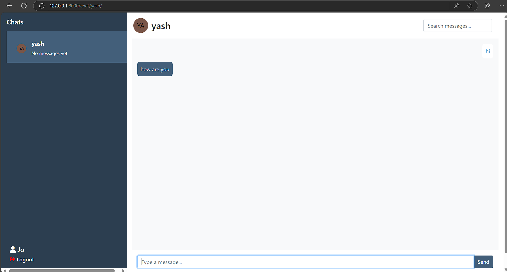

**Chat App Project**
======================


**Table of Contents**
-----------------

1. [Introduction](#introduction)
2. [Prerequisites](#prerequisites)
3. [Setup and Installation](#setup-and-installation)
4. [Running the Application](#running-the-application)

**Introduction**
---------------

This is a Django-based chat application that allows users to communicate with each other in real-time. The application uses Django Channels for WebSocket support and Django's built-in authentication system for user management.

**Prerequisites**
----------------

* Python 3.9 or higher
* Django 5.1.2 or higher
* Django Channels 3.0.3 or higher
* Daphne 3.0.2 or higher
* SQLite or other supported database

**Setup and Installation**
-------------------------

1. Clone the repository using Git:
```bash
git clone https://github.com/yash08123/90-north-task.git
```
2. Create a new virtual environment using `python -m venv`:
```bash
python -m venv chat-app-env
```
3. Activate the virtual environment:
```bash
chat-app-env\Scripts\activate
```
4. Install the required dependencies using `pip`:
```bash
pip install -r requirements.txt
```
**Running the Application**
-------------------------

1. Navigate to the project directory:
```bash
cd chat-app
```
2. Run the database migrations:
```bash
python manage.py migrate
```
3. Run the development server:
```bash
python manage.py runserver
```
4. Open a web browser and navigate to `http://localhost:8000` to access the application.

**Troubleshooting**
------------------

* If you encounter any issues during setup or installation, check the Django documentation for troubleshooting guides.
* If you encounter any issues with the application, check the Django Channels documentation for troubleshooting guides.


